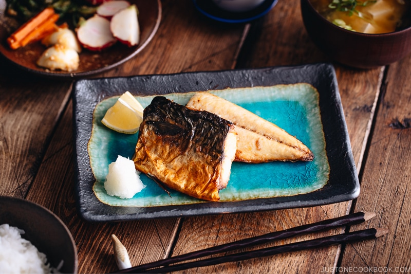

## Steps

1. Gather all the ingredients. I cut my mackerel fillets in half crosswise for presentation.
2. Coat 2 fillets mackerel (saba) with 2 Tbsp sake.
3. Pat dry with paper towels (and discard the sake) and transfer the fish to a baking sheet lined with parchment paper.
4. Sprinkle both sides of the fish with ½ tsp salt.
5. Let it sit at room temperature for 20 minutes. During this time, preheat the oven to 425ºF (218ºC) with a rack placed in the middle position. For a convection oven, reduce the cooking temperature by 25ºF (15ºC).
6. After 20 minutes, pat dry the excess moisture released from the fish.
7. Place the fish skin side down on the parchment paper and bake for 15–20 minutes, or until the flesh is golden brown.

### To serve

1. Peel and grate 1 inch daikon radish (I use a ceramic grater) and squeeze out most of the liquid.
2. Serve the grilled mackerel on individual plates with the grated daikon and 1 wedge lemon (halved) on the side. Pour a few drops of the 1 tsp soy sauce on the grated daikon and use as a refreshing condiment on the fish. Enjoy!

You can keep the leftovers in an airtight container and store in the refrigerator for 2 days.
